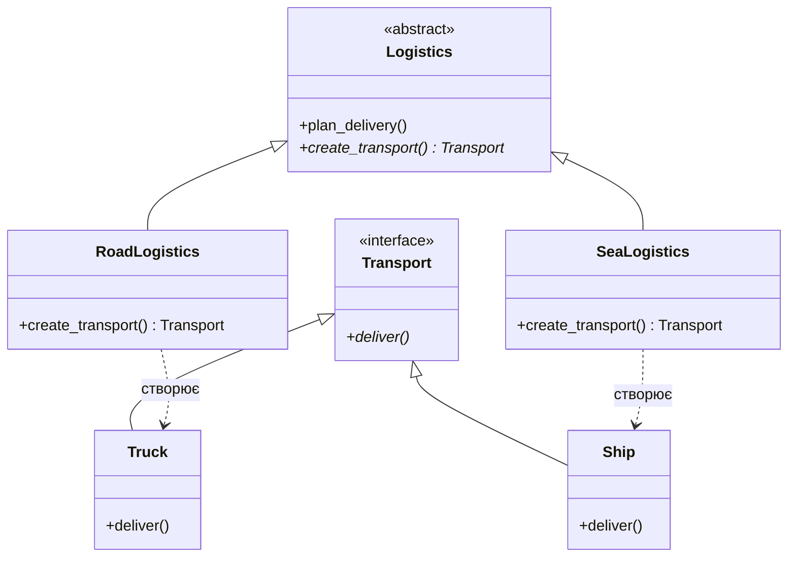

## 1. Породжувальний шаблон: Фабричний метод (Factory Method)

### Проблема

Уявіть, що ви створюєте логістичну програму. Спочатку вона працює лише з вантажівками. Весь ваш код прив'язаний до класу `Truck`. Згодом вам потрібно додати морські перевезення. Якщо код "захардкоджений" під вантажівки, додавання кораблів вимагатиме переписування всієї логіки створення об'єктів.

### Ідея реалізації

Шаблон визначає інтерфейс для створення об'єкта, але дозволяє підкласам вирішувати, який саме клас інстанціювати. Це дозволяє делегувати логіку створення конкретним "фабрикам".

### Код реалізації (Python)

```python
from abc import ABC, abstractmethod

# Продукт
class Transport(ABC):
    @abstractmethod
    def deliver(self) -> str:
        pass

# Конкретні продукти
class Truck(Transport):
    def deliver(self) -> str:
        return "Доставка сушею у коробці."

class Ship(Transport):
    def deliver(self) -> str:
        return "Доставка морем у контейнері."


class Logistics(ABC):
    @abstractmethod
    def create_transport(self) -> Transport:
        pass

    def plan_delivery(self) -> str:
        transport = self.create_transport()
        return f"Логістика каже: {transport.deliver()}"


class RoadLogistics(Logistics):
    def create_transport(self) -> Transport:
        return Truck()

class SeaLogistics(Logistics):
    def create_transport(self) -> Transport:
        return Ship()


def client_code(creator: Logistics):
    print(creator.plan_delivery())

print("Тест RoadLogistics:")
client_code(RoadLogistics())

print("\nТест SeaLogistics:")
client_code(SeaLogistics())

```

### Де застосовувати

* **Системи з багатьма типами об'єктів:** Коли заздалегідь невідомо, об'єкти яких типів доведеться створювати.
* **Бібліотеки та фреймворки:** Коли ви хочете надати користувачам можливість розширювати ваші компоненти.

---

## 2. Структурний шаблон: Адаптер (Adapter)

### Проблема

Ви маєте додаток для аналізу фондового ринку, який отримує дані у форматі XML. Ви хочете інтегрувати круту сторонню бібліотеку для аналітики, але вона приймає дані лише у форматі JSON. Їхні інтерфейси несумісні.

### Ідея реалізації

Адаптер виступає як перекладач. Він обертає об'єкт, який має незручний інтерфейс, і надає клієнту зрозумілий інтерфейс, перетворюючи виклики та дані "на льоту".

### Код реалізації (Python)

```python
class XMLData:
    """Стара система або сторонній сервіс, що видає XML."""
    def get_xml_data(self) -> str:
        return "<data><value>100</value></data>"

class JSONAnalyticsLib:
    """Сучасна бібліотека, яка хоче JSON."""
    def analyze_json(self, json_str: str):
        print(f"Аналіз даних: {json_str}")

class XmlToJsonAdapter:
    """Адаптер, що робить XML сумісним з JSON-бібліотекою."""
    def __init__(self, xml_source: XMLData):
        self.xml_source = xml_source

    def request_analysis(self, analytics_lib: JSONAnalyticsLib):
        xml_content = self.xml_source.get_xml_data()
        # Спрощена логіка конвертації XML -> JSON
        value = xml_content.split("<value>")[1].split("</value>")[0]
        json_data = f'{{"value": {value}}}'
        
        analytics_lib.analyze_json(json_data)

xml_source = XMLData()
analytics = JSONAnalyticsLib()
adapter = XmlToJsonAdapter(xml_source)

print("Робота адаптера:")
adapter.request_analysis(analytics)

```

### Де застосовувати

* **Інтеграція legacy-коду:** Коли потрібно змусити старий код працювати з новим без його повної переробки.
* **Робота з сторонніми API:** Коли формат даних сервісу не збігається з внутрішніми стандартами вашого проекту.

---

## 3. Поведінковий шаблон: Стратегія (Strategy)

### Проблема

У вас є навігатор. Він може будувати маршрут для авто. Ви додаєте пішохідний маршрут, потім маршрут для велосипеда, а згодом — для громадського транспорту. Клас навігатора стає величезним, заповненим операторами `if-else` або `switch`.

### Ідея реалізації

Шаблон виносить алгоритми в окремі класи ("стратегії"). Об'єкт контексту (навігатор) просто зберігає посилання на одну зі стратегій і делегує їй роботу. Ви можете змінювати стратегію прямо під час виконання програми.

### Код реалізації (Python)

```python
from abc import ABC, abstractmethod

# Інтерфейс стратегії
class RouteStrategy(ABC):
    @abstractmethod
    def build_route(self, start: str, end: str):
        pass


class RoadStrategy(RouteStrategy):
    def build_route(self, start, end):
        return f"Маршрут дорогами від {start} до {end} (15 хв)"

class WalkingStrategy(RouteStrategy):
    def build_route(self, start, end):
        return f"Пішохідна стежка від {start} до {end} (45 хв)"


class Navigator:
    def __init__(self, strategy: RouteStrategy):
        self._strategy = strategy

    def set_strategy(self, strategy: RouteStrategy):
        self._strategy = strategy

    def execute_route((self, start, end)):
        print(self._strategy.build_route(start, end))


nav = Navigator(RoadStrategy())
print("На машині:")
nav.execute_route("Центр", "Вокзал")

print("\nЗмінюємо план на прогулянку:")
nav.set_strategy(WalkingStrategy())
nav.execute_route("Центр", "Вокзал")

```

### Де застосовувати

* **Варіативність алгоритмів:** Коли вам потрібно використовувати різні версії алгоритму залежно від ситуації (наприклад, різні способи сортування даних або методи аутентифікації).
* **Очищення коду від розгалужень:** Якщо ви бачите багато `if` для вибору поведінки об'єкта.

---

## Результати роботи прикладів

1. **Фабричний метод:** Дозволяє системі бути незалежною від того, як створюються її продукти. При додаванні "Авіаперевезень" нам не потрібно змінювати існуючі класи `RoadLogistics` чи `SeaLogistics`.
2. **Адаптер:** Успішно перетворив внутрішній "несумісний" формат `XML` у `JSON`, що дозволило використати аналітичну бібліотеку без зміни її коду.
3. **Стратегія:** Програма змінила спосіб розрахунку маршруту миттєво через метод `set_strategy`, що робить систему дуже гнучкою.
