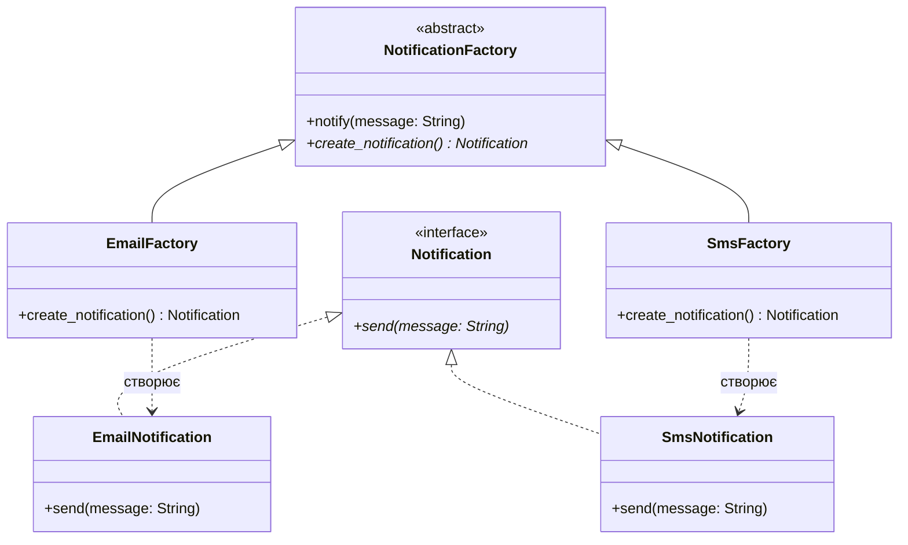
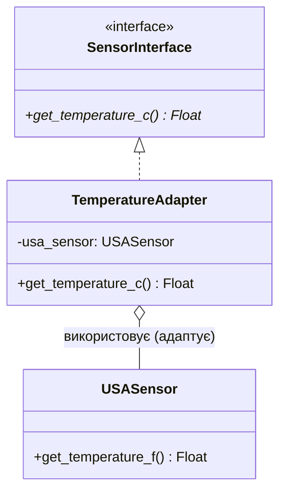
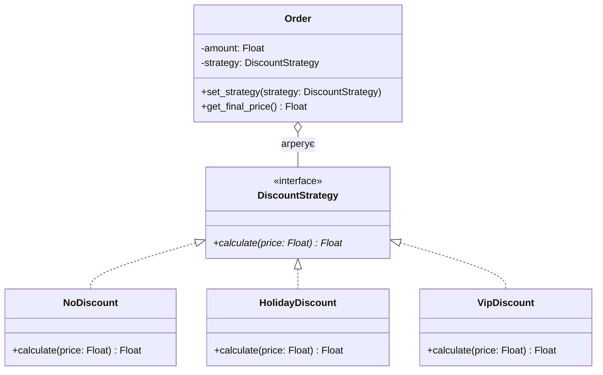

## 1. Породжувальний: Фабричний метод (Factory Method)

**Приклад: Система сповіщень (Notifications)**

### Проблема

Ваш застосунок має надсилати вітання користувачам. Спочатку ви надсилали тільки **Email**. Потім додався **SMS**, а в планах — **Push-повідомлення**. Якщо ви будете створювати об'єкти через `if-else` прямо в основному коді, він стане "брудним" і важким для розширення.

### Ідея реалізації

Ми створюємо загальний інтерфейс `Notification` і "фабрику", яка вирішує, який саме тип повідомлення створити.

### Код (Python)

```python
from abc import ABC, abstractmethod

class Notification(ABC):
    @abstractmethod
    def send(self, message: str):
        pass

class EmailNotification(Notification):
    def send(self, message: str):
        return f"Надсилаю Email: {message}"

class SmsNotification(Notification):
    def send(self, message: str):
        return f"Надсилаю SMS: {message}"

class NotificationFactory(ABC):
    @abstractmethod
    def create_notification(self) -> Notification:
        pass

    def notify(self, message: str):
        notifier = self.create_notification()
        print(notifier.send(message))

class EmailFactory(NotificationFactory):
    def create_notification(self):
        return EmailNotification()

class SmsFactory(NotificationFactory):
    def create_notification(self):
        return SmsNotification()


factories = [EmailFactory(), SmsFactory()]
for f in factories:
    f.notify("Ваше замовлення готове!")

```

**Де застосовувати:** Будь-яка система, де типи об'єктів можуть додаватися з часом (платіжні методи, типи файлів, звіти).

```mermaid
classDiagram
    class NotificationFactory {
        <<abstract>>
        +notify(message: String)
        +create_notification()* Notification
    }
    class EmailFactory {
        +create_notification() Notification
    }
    class SmsFactory {
        +create_notification() Notification
    }
    class Notification {
        <<interface>>
        +send(message: String)*
    }
    class EmailNotification {
        +send(message: String)
    }
    class SmsNotification {
        +send(message: String)
    }

    NotificationFactory <|-- EmailFactory
    NotificationFactory <|-- SmsFactory
    Notification <|.. EmailNotification
    Notification <|.. SmsNotification
    EmailFactory ..> EmailNotification : створює
    SmsFactory ..> SmsNotification : створює
```

---

## 2. Структурний: Адаптер (Adapter)

**Приклад: Робота з датчиками температури (Fahrenheit to Celsius)**

### Проблема

Ви пишете систему моніторингу погоди, яка працює в **Цельсіях (C)**. Ви купили новий крутий датчик з США, але він видає дані тільки у **Фаренгейтах (F)**. Ви не можете змінити код датчика, а переписувати всю систему під Фаренгейти — погана ідея.

### Ідея реалізації

Створити Адаптер, який "обгорне" американський датчик і буде автоматично конвертувати градуси при виклику.

### Код (Python)

```python
class USASensor:
    """Клас, який ми не можемо змінити (Adaptee)."""
    def get_temperature_f(self) -> float:
        return 86.0  # Це 30 градусів Цельсія

class SensorInterface:
    """Інтерфейс, який очікує наша система (Target)."""
    def get_temperature_c(self) -> float:
        pass

class TemperatureAdapter(SensorInterface):
    """Адаптер, що робить магію конвертації."""
    def __init__(self, usa_sensor: USASensor):
        self.usa_sensor = usa_sensor

    def get_temperature_c(self) -> float:
        temp_f = self.usa_sensor.get_temperature_f()
        return (temp_f - 32) * 5 / 9

old_sensor = USASensor()
adapter = TemperatureAdapter(old_sensor)

print(f"Система отримала: {adapter.get_temperature_c()}°C")

```

**Де застосовувати:** При підключенні сторонніх бібліотек, роботі зі старим кодом (legacy) або пристроями з різними одиницями виміру.

```mermaid
classDiagram
    class SensorInterface {
        <<interface>>
        +get_temperature_c()* Float
    }
    class TemperatureAdapter {
        -usa_sensor: USASensor
        +get_temperature_c() Float
    }
    class USASensor {
        +get_temperature_f() Float
    }

    SensorInterface <|.. TemperatureAdapter
    TemperatureAdapter o-- USASensor : використовує (адаптує)
```

---

## 3. Поведінковий: Стратегія (Strategy)

**Приклад: Система знижок в інтернет-магазині**

### Проблема

У вас є кошик товарів. Ви хочете застосовувати різні знижки: **Звичайна** (без знижок), **Святкова** (-20%) та **VIP** (-50%). Якщо писати це через `if-else`, то при додаванні нової акції "Чорна п'ятниця" вам доведеться лізти в логіку кошика.

### Ідея реалізації

Кожна знижка — це окремий клас-стратегія. Кошик просто викликає метод `apply_discount()`, не знаючи, як саме він рахується.

### Код (Python)

```python
from abc import ABC, abstractmethod


class DiscountStrategy(ABC):
    @abstractmethod
    def calculate(self, price: float) -> float:
        pass

class NoDiscount(DiscountStrategy):
    def calculate(self, price): return price

class HolidayDiscount(DiscountStrategy):
    def calculate(self, price): return price * 0.8

class VipDiscount(DiscountStrategy):
    def calculate(self, price): return price * 0.5

class Order:
    def __init__(self, amount: float, strategy: DiscountStrategy):
        self.amount = amount
        self.strategy = strategy

    def set_strategy(self, strategy: DiscountStrategy):
        self.strategy = strategy

    def get_final_price(self):
        return self.strategy.calculate(self.amount)


order = Order(1000, NoDiscount())
print(f"Звичайна ціна: {order.get_final_price()} грн")

order.set_strategy(HolidayDiscount())
print(f"Ціна на свята: {order.get_final_price()} грн")

```

**Де застосовувати:** Системи розрахунку податків, методи сортування даних, різні алгоритми стиснення файлів.

```mermaid
classDiagram
    class Order {
        -amount: Float
        -strategy: DiscountStrategy
        +set_strategy(strategy: DiscountStrategy)
        +get_final_price() Float
    }
    class DiscountStrategy {
        <<interface>>
        +calculate(price: Float)* Float
    }
    class NoDiscount {
        +calculate(price: Float) Float
    }
    class HolidayDiscount {
        +calculate(price: Float) Float
    }
    class VipDiscount {
        +calculate(price: Float) Float
    }

    Order o-- DiscountStrategy : агрегує
    DiscountStrategy <|.. NoDiscount
    DiscountStrategy <|.. HolidayDiscount
    DiscountStrategy <|.. VipDiscount
```

---


Чи потрібно підготувати для вас структуру README файлу, щоб ви могли просто вставити туди ці описи та код?
